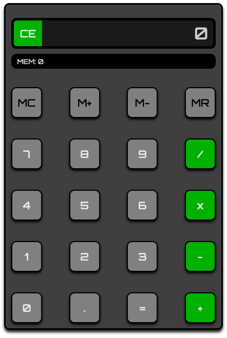

# Calculator Web App

## Description
The application was developed to showcase my JavaScript skills. It allows for for continuous operations to be executed, memory buttons and I added some extra styling to make it my own. This project tested my problem solving and logic skills.

## Technologies/Design

###### Technology Stack
- HTML, CSS, JavaScript

###### Other Tools
- Google's Draw.IO to help with initial project design and structure. [Diagram](https://drive.google.com/file/d/1vqM3t-Y6Gz23v46k4-g9TtRWZD5Dx1WS/view?usp=sharing)

NOTE: This diagram only shows the steps taken before starting the project. Does not represent final draft. 

## Author
- Aliel Reyes - Software Developer [LinkedIn](https://www.linkedin.com/in/alielreyes/).

